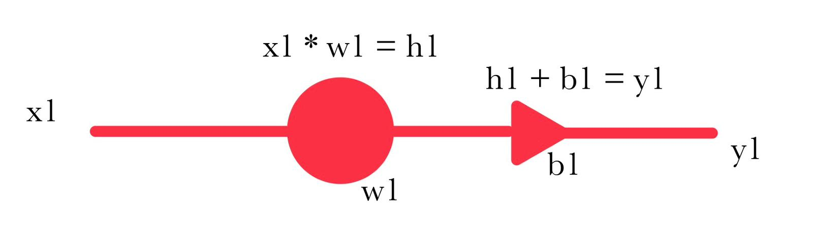
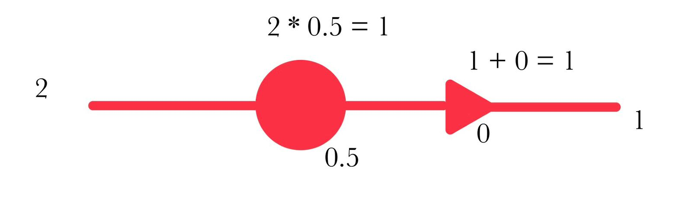
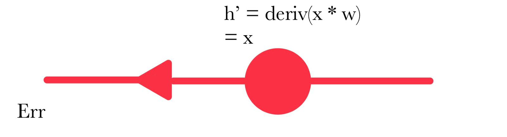
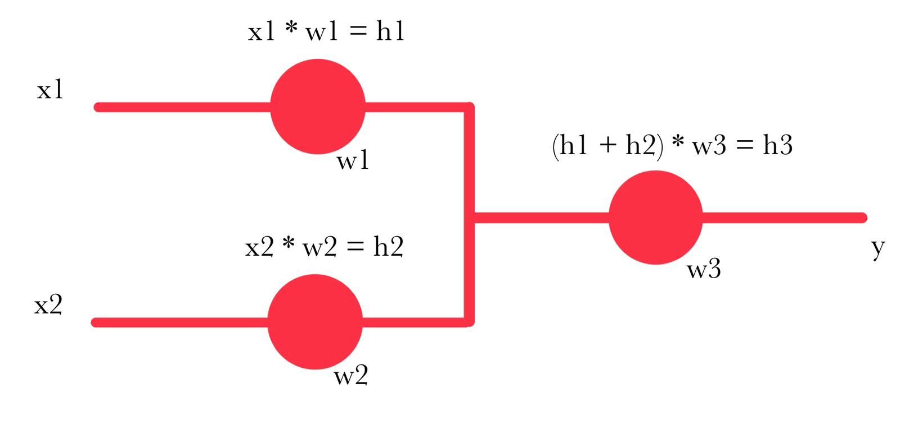

# RETI NEURALI

## 1. Rete neurale da 1 nodo

**Richiesta:**
Vogliamo creare una rete neurale della funzione **y = 2x**. Essendo una funzione lineare riusciamo a crearla anche attraverso un solo nodo.

**Dati iniziali:**
* **x** = 2
* **w1** = 0.5 (peso casuale iniziale)
* **b1** = 0 (ipotesi semplificativa)
* **target** = 4

### Forwarding pass

* Operazione: 2 * 0.5 = 1 (h1)
* Risultato finale: 1 + 0 = 1 (y1)
* **Errore lineare (per semplicità):** y - target = 1 - 4 = **-3**

---

### Back propagation

Correggiamo il peso **w** dell'unico nodo moltiplicando il suo errore in output per la derivata della sua formula di forward rispetto a **w**, ottenendo così il gradiente.

* **h'** = derivata(x * w) = x
* **Gradiente del nodo (U):** Err * derivata parziale = Err * x = -3 * 2 = **-6**

Per correggere il peso **w** sottraiamo al peso stesso il gradiente, moltiplicato per il **learning rate (lr)** pari a 0.1 (che imposta velocità e precisione):

* **w_new** = w - (lr * grad(w)) = 0.5 - (0.1 * -6) = **1.1**

### Forwarding pass step 2
* **y_new** = 2 * 1.1 + 0 = 2.2
* **Err_new** = 2.2 - 4 = **-1.8**
L'errore è diminuito, ma dobbiamo andare avanti finché il modello non è abbastanza preciso.

---

### Forwarding pass steps successivi

**Step 3:**
* grad = -1.8 * 2 = -3.6
* w_new = 1.1 - (0.1 * -3.6) = **1.46**
* y = 2 * 1.46 = 2.92
* err_new = 2.92 - 4 = **-1.08**

**Step 4:**
* grad = -1.08 * 2 = -2.16
* w_new = 1.46 - (0.1 * -2.16) = **1.676**

---

## 2. Rete neurale multinodo

**Richiesta:**
Modello che determina se un appartamento di **x1** mq e con prezzo **x2** è più o meno un'opportunità, con **y** da 0.0 a 1.0.

* I mq (x1) vanno da 0 a 100 (normalizzati 0.0-1.0)
* Il prezzo (x2) va da 0 a 100.000 (normalizzato 0.0-1.0)
* **Parametri:** w1 = w2 = w3 = 0.5 | lr = 0.1 | b = 0

### Forward pass (training entry #1)
* x1 = 1.0, x2 = 0.3 | **target** = 0.2
* h1 = 1.0 * 0.5 = 0.5
* h2 = 0.3 * 0.5 = 0.15
* y = (h1 + h2) * w3 = 0.65 * 0.5 = **0.325**
* **Err:** y - target = 0.325 - 0.2 = **0.125** (previsione alta)

### Back propagation (training entry #1)
* **gradiente nodo 3** = Err * (h1 + h2) = 0.125 * 0.65 = **0.081**
* **grad 1** = (Err * w3) * x1 = 0.125 * 0.5 * 1.0 = **0.062**
* **grad 2** = 0.125 * 0.5 * 0.3 = **0.018**

**Aggiornamento pesi:**
* w3_new = 0.5 - (0.1 * 0.081) = **0.492**
* w1_new = 0.5 - (0.1 * 0.062) = **0.494**
* w2_new = 0.5 - (0.1 * 0.018) = **0.498**

---

### Forward pass (training entry #2)
* x1 = 0.8, x2 = 0.8 | **target** = 0.85
* h1 = 0.8 * 0.494 = 0.395
* h2 = 0.8 * 0.498 = 0.398
* y = (h1 + h2) * w3 = 0.793 * 0.492 = **0.390**
* **Err:** y - target = 0.390 - 0.85 = **-0.46** (previsione bassa)

### Back propagation (training entry #2)
* grad 3 = -0.46 * 0.793 = **-0.364**
* grad 1 = -0.46 * 0.492 * 0.8 = **-0.181**
* grad 2 = -0.46 * 0.492 * 0.8 = **-0.181**

**Aggiornamento pesi:**
* w3_new = 0.492 - (0.1 * -0.364) = **0.528**
* w1_new = 0.494 - (0.1 * -0.181) = **0.512**
* w2_new = 0.498 - (0.1 * -0.181) = **0.516**

**Conclusione:** Abbiamo finito un'epoca (training su tutto il set per un intero step). Per allenare il modello si continua finché non si ottiene un buon margine d'errore senza sforare nell'overfitting.